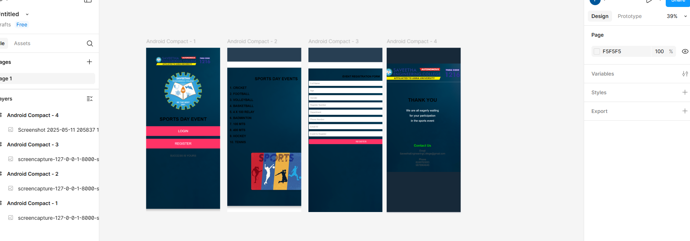
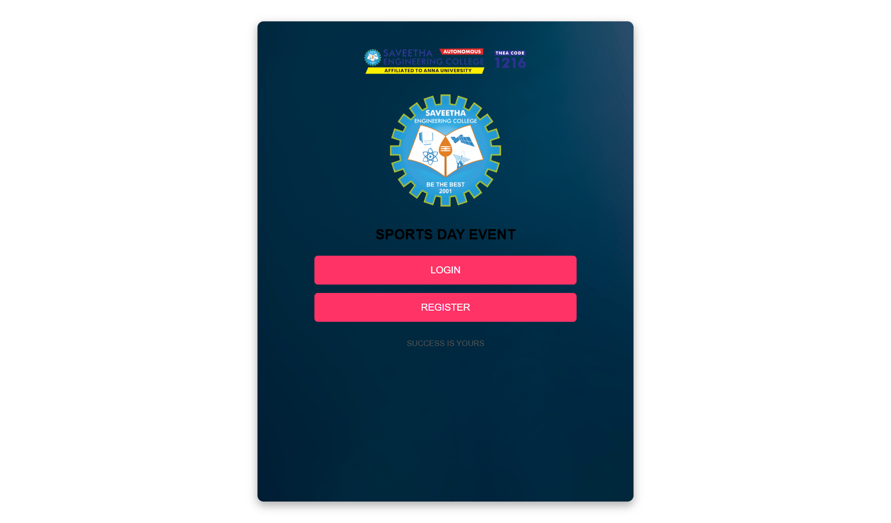
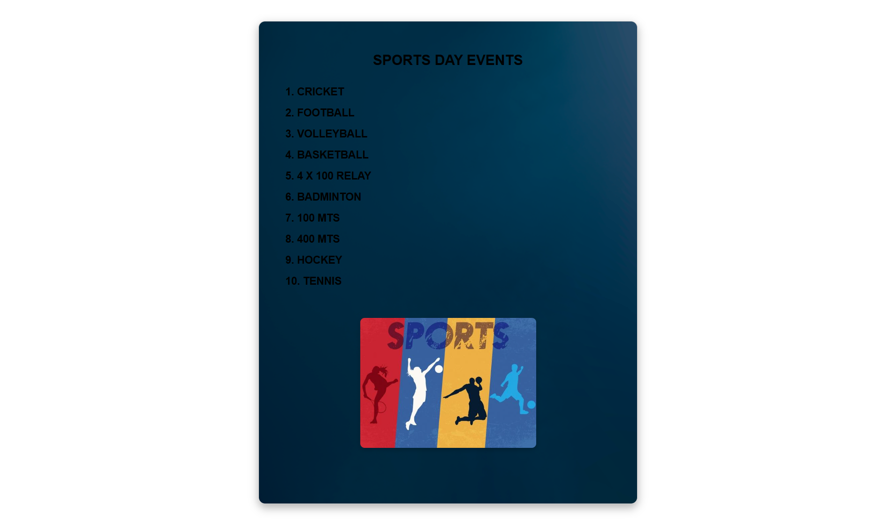
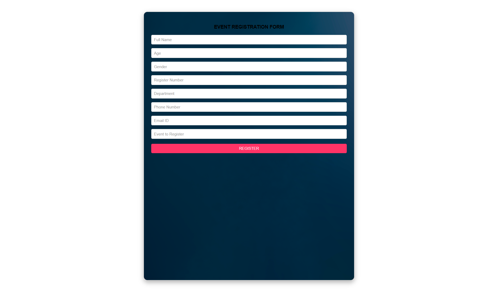
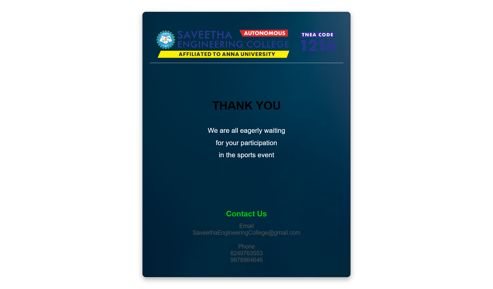

# Ex09 Event Registration Web Application
# Date:10.05.2025
# AIM:
To design, develop and deploy a web application for event registration.

# DESIGN STEPS:
## Step 1:
Create a new frame.

## Step 2:
Select any one preset size of your choice.

## Step 3:
Select the shapes you need.

## Step 4:
Import images as needed.

## Step 5:
Create pages based on your need and link them.

## Step 6:
Validate the HTML and CSS code.

## Step 6:
Publish the website in the given URL.

# DESIGN TOOL:
Figma

# CODE:
home page.html

```
<div style="margin: 0; font-family: Arial, sans-serif; text-align: center; width: 100%; max-width: 800px; margin: 40px auto; background: linear-gradient(to bottom, #e6f7ff, #ffffff); border: 2px solid #ccc; border-radius: 15px; box-shadow: 0 8px 20px rgba(0, 0, 0, 0.3); padding: 50px 30px; background-image: url('cover.png'); background-size: cover; background-repeat: no-repeat; background-position: center; min-height: 1000px;">
<br>
>
<div style="font-size: 32px; font-weight: bold; color: #000; margin: 30px 0;">SPORTS DAY EVENT</div>
 <div style="width: 70%; margin: 20px auto; padding: 20px; background-color: #ff3366; color: #fff; border: none; border-radius: 8px; font-size: 22px; cursor: pointer; text-align: center;">LOGIN</div>
<div style="width: 70%; margin: 20px auto; padding: 20px; background-color: #ff3366; color: #fff; border: none; border-radius: 8px; font-size: 22px; cursor: pointer; text-align: center;">REGISTER</div>
<div style="font-size: 18px; color: #555; margin: 40px 0;">SUCCESS IS YOURS</div>
</div>


```

evet page.html

```
<div style="margin: 0; font-family: Arial, sans-serif; text-align: center; width: 100%; max-width: 800px; margin: 40px auto; background: linear-gradient(to bottom, #e6f7ff, #ffffff); border: 2px solid #ccc; border-radius: 15px; box-shadow: 0 8px 20px rgba(0, 0, 0, 0.3); padding: 50px 30px; background-image: url('cover.png'); background-size: cover; background-repeat: no-repeat; background-position: center; min-height: 1000px;">
 <div style="font-size: 32px; font-weight: bold; color: #000; margin: 20px 0;">SPORTS DAY EVENTS</div>
<div style="text-align: left; font-size: 24px; color: #000; margin: 30px; line-height: 2; font-weight: bold;">
        1. CRICKET<br>
        2. FOOTBALL<br>
        3. VOLLEYBALL<br>
        4. BASKETBALL<br>
        5. 4 X 100 RELAY<br>
        6. BADMINTON<br>
        7. 100 MTS<br>
        8. 400 MTS<br>
        9. HOCKEY<br>
        10. TENNIS
    </div>
    
</div>

```

registration page.html

```
<div style="margin: 0; font-family: Arial, sans-serif; text-align: center; width: 100%; max-width: 800px; margin: 40px auto; background: linear-gradient(to bottom, #e6f7ff, #ffffff); border: 2px solid #ccc; border-radius: 15px; box-shadow: 0 8px 20px rgba(0, 0, 0, 0.3); padding: 50px 30px; background-image: url('cover.png'); background-size: cover; background-repeat: no-repeat; background-position: center; min-height: 1000px;">
    <div style="font-size: 20px; font-weight: bold; color: #000; margin-bottom: 20px;">EVENT REGISTRATION FORM</div>
    <div style="background-color: #fff; border: 1px solid #ccc; border-radius: 5px; padding: 10px; text-align: left; color: #999; margin-bottom: 15px;">Full Name</div>
    <div style="background-color: #fff; border: 1px solid #ccc; border-radius: 5px; padding: 10px; text-align: left; color: #999; margin-bottom: 15px;">Age</div>
    <div style="background-color: #fff; border: 1px solid #ccc; border-radius: 5px; padding: 10px; text-align: left; color: #999; margin-bottom: 15px;">Gender</div>
    <div style="background-color: #fff; border: 1px solid #ccc; border-radius: 5px; padding: 10px; text-align: left; color: #999; margin-bottom: 15px;">Register Number</div>
    <div style="background-color: #fff; border: 1px solid #ccc; border-radius: 5px; padding: 10px; text-align: left; color: #999; margin-bottom: 15px;">Department</div>
    <div style="background-color: #fff; border: 1px solid #ccc; border-radius: 5px; padding: 10px; text-align: left; color: #999; margin-bottom: 15px;">Phone Number</div>
    <div style="background-color: #fff; border: 1px solid #ccc; border-radius: 5px; padding: 10px; text-align: left; color: #999; margin-bottom: 15px;">Email ID</div>
    <div style="background-color: #fff; border: 1px solid #ccc; border-radius: 5px; padding: 10px; text-align: left; color: #999; margin-bottom: 15px;">Event to Register</div>
    <div style="margin-top: 20px; background-color: #ff3366; color: #fff; padding: 10px; border-radius: 5px; font-size: 16px; cursor: pointer; text-align: center;">REGISTER</div>
</div>

```
contact us page.html

```
<div style="margin: 0; font-family: Arial, sans-serif; text-align: center; width: 100%; max-width: 800px; margin: 40px auto; background: linear-gradient(to bottom, #e6f7ff, #ffffff); border: 2px solid #ccc; border-radius: 15px; box-shadow: 0 8px 20px rgba(0, 0, 0, 0.3); padding: 50px 30px; background-image: url('cover.png'); background-size: cover; background-repeat: no-repeat; background-position: center; min-height: 1000px;">
    
    <div style="font-size: 48px; color: #000; font-weight: bold; margin-bottom: 50px; box-sizing: border-box; margin-top: 150px;">
        THANK YOU
    </div>
        <div style="font-size: 28px; color: #ffffff; margin-bottom: 50px; line-height: 1.8;">
        We are all eagerly waiting<br>
        for your participation<br>
        in the sports event
    </div>
    <div style="font-size: 32px; font-weight: bold; color: #00c700; margin-top: 200px; margin-bottom: 20px;">
        Contact Us
    </div>
    <div style="font-size: 24px; color: #555; margin-bottom: 30px;">
        Email<br>
        SaveethaEngineeringCollege@gmail.com
    </div>
    <div style="font-size: 24px; color: #555;">
        Phone<br>
        8249763553<br>
        9878964646
    </div>

</div>

```
# OUTPUT:






# RESULT:
The program to design, develop and deploy a web application for event registration is completed successfully.
